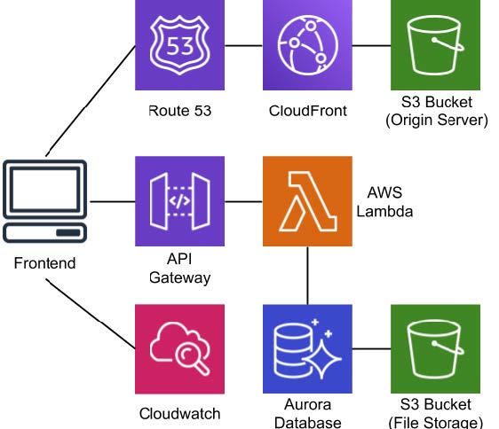
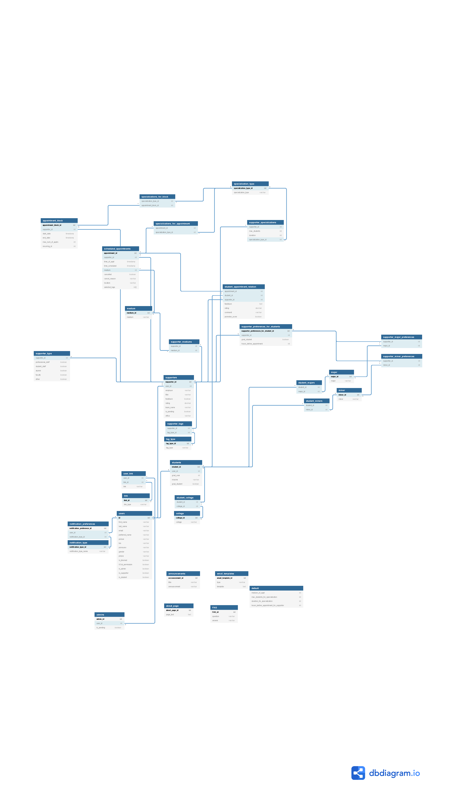

# 320-S20-Track1
Integration Track 1

## AWS Cloud
Cloud Team: ***Five Guys(like the restaurant)***

### ReachOUT
* [via S3 Static Website Hosting](http://t1-s3-us-east-1.s3-website-us-east-1.amazonaws.com/)
* [via CloudFront](https://d2x4ccvbxfwkps.cloudfront.net/)
* [via *reachout.cics.umass.edu*](https://reachout.cics.umass.edu/)

### Consoles
* [**Console Home**](https://us-east-2.console.aws.amazon.com/console/home?region=us-east-2)
* [**IAM**](https://console.aws.amazon.com/iam/home?#/home)
* [**S3 Bucket**](https://console.aws.amazon.com/s3/home?region=us-east-1)
  * [**Host**](https://console.aws.amazon.com/s3/buckets/t1-s3-us-east-1/?region=us-east-1)
  * [**Logs**](https://console.aws.amazon.com/s3/buckets/t1-s3-us-east-log/?region=us-east-1)
  * [**Images**](https://console.aws.amazon.com/s3/buckets/t1-s3-us-east-1-images/?region=us-east-1)
  * [**Storage**](https://console.aws.amazon.com/s3/buckets/t1-s3-us-east-1-storage/?region=us-east-1)
* [**RDS**](https://us-east-2.console.aws.amazon.com/rds/home?region=us-east-2#database:id=postgres;is-cluster=true)
* [**Lambda Functions**](https://us-east-2.console.aws.amazon.com/lambda/home?region=us-east-2#/functions)
* [**API Gateway**](https://us-east-2.console.aws.amazon.com/apigateway/home?region=us-east-2#/apis/7jdf878rej/resources/zgbyvb7kf1)
* [**CloudFront**](https://console.aws.amazon.com/cloudfront/home?region=us-east-1#distribution-settings:EGSMGROFKR7F8)
* [**Cognito**](https://us-east-2.console.aws.amazon.com/cognito/users/?region=us-east-2#/pool/us-east-2_TOeWJwIy0/details?_k=9t67ph)

### Cloud Diagram

### Getting start
1. Go to [AWS Console](https://massit-umass-career-services.signin.aws.amazon.com/console).
2. Type in your `IAM user name` and `Password` from `.cvs` file we gave you.
3. ***Be Aware***: these are the password policies you need to pay attention to when you are asked to change the password during 1st-time login.
    >1. Minimum password length is 14 characters
    >2. Require at least one uppercase letter from Latin alphabet (A-Z)
    >3. Require at least one lowercase letter from Latin alphabet (a-Z)
    >4. Require at least one number
    >5. Require at least one non-alphanumeric character (!@#$%^&*()_+-=[]{}|')
    >6. Password expires in 90 day(s)
    >7. Allow users to change their own password
    >8. Remember last 24 password(s) and prevent reuse
4. `Sign in`
5. Find the service you are looking for.
6. ***Congs!*** You made it!

### IAM Credential and Permissions
[**IAM Console**](https://console.aws.amazon.com/iam/home?#/home)
#### Tutorial
* [AWS IAM Deep Dive.](https://medium.com/@thomas.storm/aws-iam-deep-dive-chapter-1-essentials-a9cfb1931a01)

#### Permission Policies
|                 Team                |  Group   |                                                                                                                                                  Permissions                                                                                                                                                  |                                                         Remark                                                        |
|-------------------------------------|----------|---------------------------------------------------------------------------------------------------------------------------------------------------------------------------------------------------------------------------------------------------------------------------------------------------------------|-----------------------------------------------------------------------------------------------------------------------|
| **Big Hero 6   King Codras**     | Frontend | *S3FullAccess   AmazonAPIGatewayInvokeFullAccess   AmazonAPIGatewayPushToCloudWatchLogs   AWSWAFReadOnlyAccess   CloudFrontFullAccess   AmazonAPIGatewayAdministrator   AmazonRDSDataFullAccess   AmazonRDSReadOnlyAccess   AWSLambdaReadOnlyAccess   AWSWAFConsoleReadOnlyAccess* | *None*                                                                                                                |
| **Segfault Line   Team Kakashi** | Lambda   | *AmazonRDSFullAccess   AWSLambdaFullAccess   AmazonRDSDataFullAccess   AWSWAFConsoleReadOnlyAccess   **RoleCreateWithBounds**   **CreatePolicy***                                                                                                                                              | For information regarding the creation of roles to use with services, please refer to [Role Creation](#Role-Creation) |
| ***5 Guys***                        | Cloud    | *AdministratorAccess*                                                                                                                                                                                                                                                                                         | *None*                                                                                                                |

#### Role Policies
|          Role         |                                                             Permissions                                                             |
|-----------------------|-------------------------------------------------------------------------------------------------------------------------------------|
| **T1LambdaFullAcess** | *AWSLambdaFullAccess   AmazonAPIGatewayInvokeFullAccess   AmazonRDSDataFullAccess   **CognitoPolicies**   **sesPerms*** |

***Remark***: To simplify the process of development, we combine all Lambda related permission policies into one giant Role. It works well so far, but may lead to security concerns.

#### Role Creation
**For the Lambda teams only:** Any policy can be written and attached to roles you create. However, you may only create roles that also have the T1LambdaPermissions policy set as their PermissionBoundary. This ensures that any role you create cannot have more permissions than your account has **REGARDLESS OF THE POLICY ATTACHED**. To do this, ensure that you create the roles needed before the creation of lambdas, and ensure that at the bottom of the creation menu you set the RoleBoundary to T1LambdaPermissions. If you do not do this, you **WILL NOT BE ABLE TO CREATE THE ROLE**.

### S3 Bucket, CloudFront, and Route 53
#### Tutorial
* [Host a Static Site on AWS, using S3 and CloudFront](https://www.davidbaumgold.com/tutorials/host-static-site-aws-s3-cloudfront/)

#### Buckets
[S3 Console](https://console.aws.amazon.com/s3/home?region=us-east-1)
##### [**Host**](https://console.aws.amazon.com/s3/buckets/t1-s3-us-east-1/?region=us-east-1)
*Hosting the static website*
##### [**Logs**](https://console.aws.amazon.com/s3/buckets/t1-s3-us-east-log/?region=us-east-1)
*Storing CloudFront Logs*
##### [**Images**](https://console.aws.amazon.com/s3/buckets/t1-s3-us-east-1-images/?region=us-east-1)
*Storing resumes and other files*
##### [**Storage**](https://console.aws.amazon.com/s3/buckets/t1-s3-us-east-1-storage/?region=us-east-1)
*Storing pictures and images*

##### Remark
The [**Host**](https://console.aws.amazon.com/s3/buckets/t1-s3-us-east-1/?region=us-east-1) bucket hosts the website. Currently it's open to public to access the website. But since the CloudFront is set up, it could be restrict to only accessed via CloudFront to reach further security.

#### CloudFront
[CloudFront Console](https://console.aws.amazon.com/cloudfront/home?region=us-east-1#distribution-settings:EGSMGROFKR7F8)

##### Remark
Setting up CloudFront is really easy and straightforward. Be careful ***DO NOT*** use the originally S3 Bucket URL in the default pull down list for `Origin Domain Name`. Please use the website endpoint URL in the "Static Website Hosting" section of the properties in S3 Bucket Console.

#### Route 53
We do not use Route 53 to register the domain, so don't worry about it.

### RDS Database
* [RDS Console](https://us-east-2.console.aws.amazon.com/rds/home?region=us-east-2#database:id=postgres;is-cluster=true)
* [DB Schema](https://dbdiagram.io/d/5e97803e39d18f5553fdab5a)

#### Database Schema
*Updated 5/4 10am*  
[Click here for Full Version](https://dbdiagram.io/d/5e97803e39d18f5553fdab5a)

#### Changes
##### 4/29 6pm
* college varchar removed from students table
* recurring_id column added to appointment_block table
* Actually added specialization_for_appointment table to AWS
* supporter_major_preferences and supporter_minor_preferences are now 2 tables instead of 1 combined one

##### 4/29 7am
* added tags relational table instead of storing the tags as a varchar array
* hours_before_appointment stores the time (in hours) before an appointment that supporters prefer to get appointments, this is a new field in supporter_preferences_for_students
* minors have been added to supporter_major_preferences
* in scheduled_appointments, the tags the student selected for the appointment are stored in an int array called “selected_tags"
* got rid of job_search in students and supporter_preferences_for_students table
* deleted number of students from appointment_block
* check duration in supporter_specializations is divisible by 5
* specializations_for_appointment relational table added
* check supporter_preferences_for_students_id in supporter_preferences_for_students is equal to supporter_id (the different id is important)
* added team_name for the team a supporter belongs to (varchar)
* got rid of password and salt_key in users
* added student_college relational table
* Added default table (to be used by lambdas as a config file)

### Lambda Functions and API Gateway
* [**Lambda Console**](https://us-east-2.console.aws.amazon.com/lambda/home?region=us-east-2#/functions)
* [**API Gateway Console**](https://us-east-2.console.aws.amazon.com/apigateway/home?region=us-east-2#/apis/7jdf878rej/resources/zgbyvb7kf1)

#### Remark
The Back-end teams and Front-end teams are granted with all permission to set up Lambda Functions and API Gateway. And the documentation of integration tests is in [*Low Level Design Document*](https://docs.google.com/document/d/1HOH07ZS9-GEInBepVvsBIM0y1Hgq3lrCl4xJjspKBGc/edit?usp=sharing).

### Cognito
* [**Cognito Console**](https://us-east-2.console.aws.amazon.com/cognito/users/?region=us-east-2#/pool/us-east-2_TOeWJwIy0/details?_k=9t67ph)

#### Tutorial
* [AWS Cognito Tutorial Part I | Cognito User Pool & AWS Amplify setup](https://www.youtube.com/watch?v=EaDMG4amEfk&t=1168s)
* [AWS Cognito Tutorial Part II | Sign in & registration](https://www.youtube.com/watch?v=2SaO1Pvah2k&t=261s)
* [Cognito Commands](https://docs.aws.amazon.com/cli/latest/reference/cognito-idp/index.html#cli-aws-cognito-idp)

#### Overview
Amazon Cognito is a service that lets you add sign in, sign up and other permission restrictions to a website or mobile app. it was integrated with the website easily and handled complicated steps in the sign-in and sign-up process such as email verification and user authentication. Cognito is easily scalable to more than millions of user and its free tier handles 50,000 monthly active users, which should be enough for ReachOut, but if this number isn't enough, the cost for each monthly active user after 50,000 is only $0.00550.

### Backlog
#### AWS SES
Currently the scripts for email notifictions for appointments including sending .ics files with calendar invites are using a standard SMTP python library. This method of sending emails is insecure and it would the preferable to use the more secure AWS SES to send email invites. In order to set this up, the SES environment must be moved to a production environment from its current sandbox environment. The sandbox environment only allows emails to me sent from and to SES verified emails. Use [this tutorial](https://docs.aws.amazon.com/ses/latest/DeveloperGuide/request-production-access.html) to migrate out of the SES sandbox and into the production environment.

#### Web Application Firewall
We can deploy ACL(Access Control List) to filter any part of the web request, such as IP addresses, HTTP headers, HTTP body, or URI strings. This allows us to block common attack patterns, such as SQL injection or cross-site scripting.  

We didn’t deploy it because it’s not part of the non-functional requirements and it makes
extra cost.
